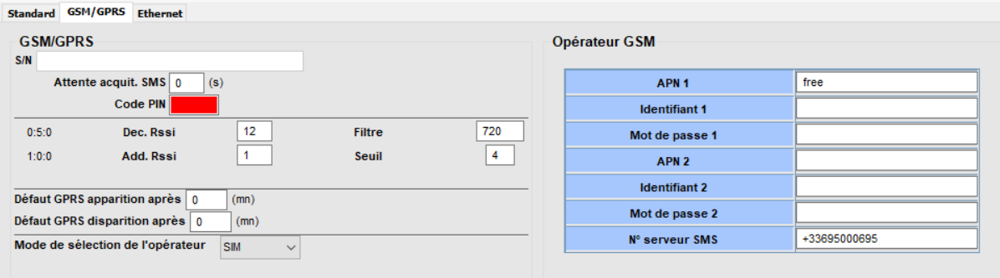
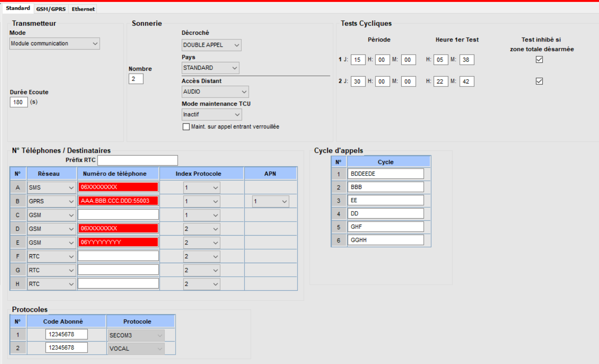
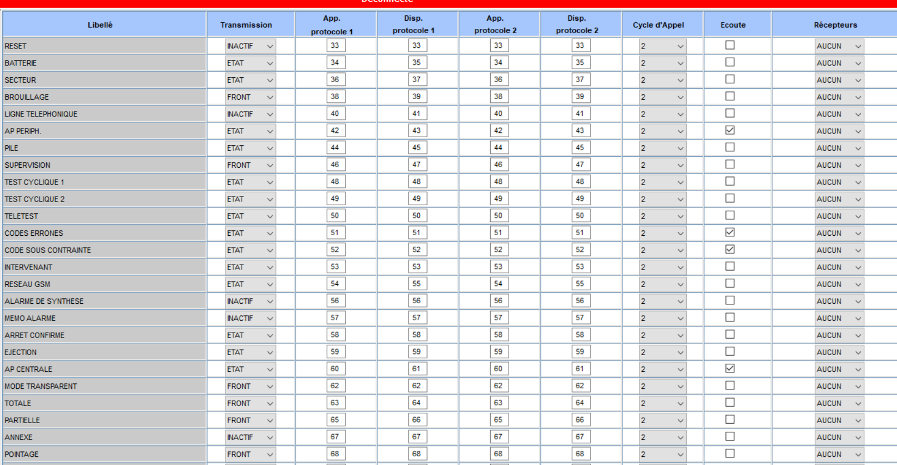
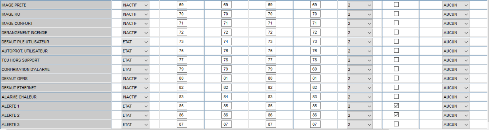
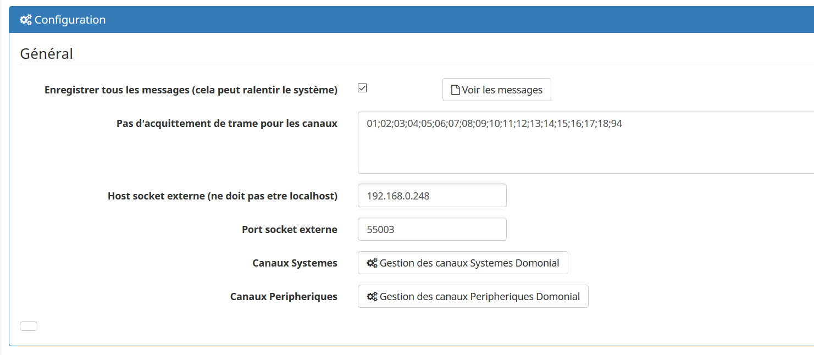
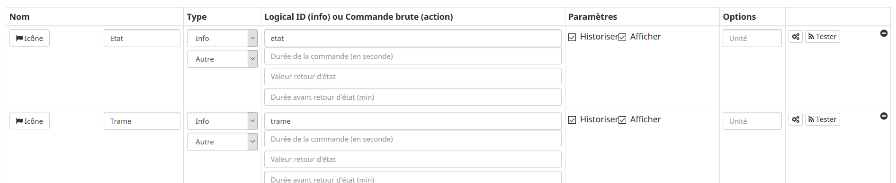
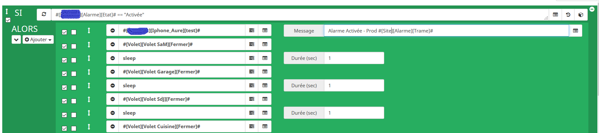
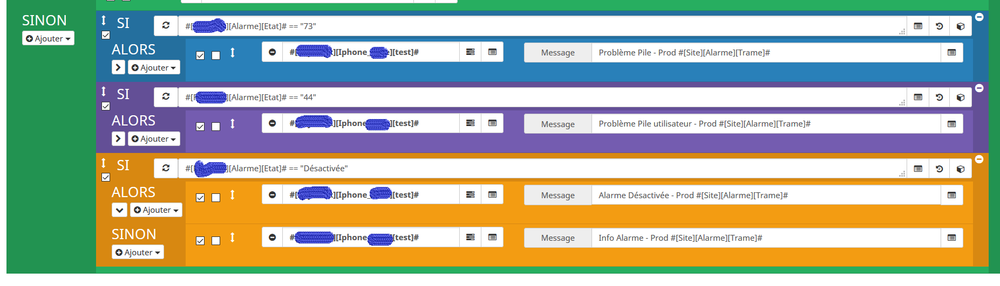

Description
===

Le plugin Domonial permet de recevoir les notifications que les alarmes domonial (PMI8FR-STD-7 ou PME8FR-STD7G)
envoi au travers d'une configuration de type "telesurveillance" en utilisant le GPRS de la carte SIM.
Une simple carte SIM suffit, pas d'abonnement data necessaire.

Configuration de la centrale
===

Tout d'abord, il faut configurer la centrale d'alarme grâce à DOMOPC, pour envoyer les notifications via GPRS

Nous allons commencer par configurer la carte GSM. nous nous rendons sur le menu Transmetteur, onglet GSM/GPRS

Ici, nous configurons juste :
-    Le code pin de la carte SIM
-    L'APN correspondant à l'opérateur (dans l'exemple, il s'agit de l'APN de free)

Puis, ensuite, nous configurerons comment la centrale doit transmettre les infos à jeedom. Nous nous positionnons dans
le menu transmetteur, onglet standard.

Attention, cette partie doit deja etre configurée pour qu'en cas de déclenchement, l'alarme appel sur un N° de téléphone au 
travers de la ligne téléphonique ou au travers de la carte SIM. Ne modifiez donc pas les paramètres existants si vous ne savez 
pas à quoi ils correspondent.

Ici, ce qui nous interresse sont :

-    N° Téléphones/Destinataires. Ici on selectionne le réseau de type GPRS et configure l'adresse IP(public) et le port (AAA.BBB.CCC.DDD:55003) 
de notre jeedom (utilisé le NAT de votre Firewall ci-necessaire) dans un des emplacements libres de A, B, ou C (le GPRS n'est pas disponible pour
les autres emplacements). Ensuite on selectionne le protocole (celui qui n'est pas utilisé par l'appel vocale de votre alarme) et c'est donc ce protocole qui sera utilisé
dans la configuration des vos canaux sysèmes plus bas. Enfin, on selectionne l'apn configuré dans l'étape précédente (dans mon exemple 1).

-    Il est ensuite necessaire de configurer le cycle d'appel. Ce paramètre sera à configurer dans les canaux systèmes plus loin.
Pour configurer le cycle d'appel, il suffit de renseigner trois fois la lettre du N° de Téléphones/destinataire que nous avons configurés 
(dans mon exemple j'ai configuré le destinataire B, mon cycle d'appel est donc le N°2: BBB). Cela permet à l'alarme de réemettre 3 fois 
la notification au cas ou il y aurait un problème GSM/Internet.

-    Le dernier paramètre a configurer dans ce menu est le protocole. Comme vu plus haut, nous ne toucherons pas au paramètres utilisé par la partie vocale.
Nous modifierons donc le second protocole utilisé c-dessus. il suffit de renseigner un code site (au choix. Seul contrainte 8 digits),
Puis choisir le protocole utilisé par la centrale=> SECOM3.

Enfin, nous allons configurer les alarmes qui seront remontés dans Jeedom.

Seul les canaux systèmes sont configurés pour être remontés dans Jeedom.

nous irons donc configurer les canaux systèmes. Vous trouverez un exemple de configuration ci-dessous.

Les choses importantes à savoir :
-    le champ Transmission permet de desactiver l'emission d'une notification pour cette alerte, 
FRONT permet de remonter simplement le passage d'un etat OK vers NOK, mais pas le retour à la normale,
ETAT pertmet d'avoir le changement d'etat OK vers NOK et le retour à la normale.

-    Ensuite, nous allons configurer les codes envoyés pour identifier l'alarme et son état. Dans le cas d'une 
transmission FRONT, un seul code suffit, pour une transmission ETAT, il sera necessaire de configurer deux codes. 
Pour ma part, je fixe les memes codes pour le protocole 1 et 2, mais il est normalement seulement necessaire de 
configurer le procotole que nous avons configuré à l'étape précédente. 

-    Enfin, nous configurons le cycle d'appel que nous avons précédement configuré.

Configuration du plugin dans Jeedom
===

Après l'avoir téléchargé sur le Market, il sera nécessaire de configurer le plugin. Ce qui nous interesse se trouve 
dans l'encadré Configuration

Dans la configuration du plugin, nous avons la possibilité de ne pas acquitter certain type d'alarme, le plugin les recevra, 
mais ne les acquittera pas. Ce qui fait que l'alarme continuera son cycle d'appel. Cette configuration peux etre utilise si 
votre cycle d'appel est configuré pour le GPRS et ensuite pour l'appel vocal.

Ensuite, il faut configurer l'adresse ip (privée) de Jeedom et le port du plugin (par defaut : 55003)

Enfin, il faut configurer les codes d'alarmes à l'identique de ceux qu'on a configuré sur l'alarme. Nous ne modifierons que 
les codes systèmes, mais le plugin peut aussi recevoir les codes Peripheriques (il faudra dans ce cas les configurer sur 
l'alarme).

je ne rentre pas dans les details, car la configuration est exactement la même que celle sur la centrale d'alarme.

Ajout d'équipement dans le plugin
===

L'ajout d'un équipement dans Jeedom se passe comme pour tous les autres plugins. Il suffit de cliquer sur Ajouter. Une 
nouvelle fenetre va s'ouvrir pour donner un nom à l'équipement (qui correspond à la centrale d'alarme).

Ensuite, la configuration est identique aux autres plugin, sauf pour le champ Site. Celui-ci correspond au site que nous 
avons renseigné dans la centrale d'alarme dans le menu Transmetteur/Standard/Protocoles.

Nous passons dans l'onglet Commandes, il suffit de rajouter deux commandes décrites ci-dessous.

C'est finit, le plugin est pret à fonctionner. 

Utilisation Avancée
===

Il est conseillé d'utiliser ce plugin avec l'usage des scénario de jeedom. Un exemple ci-dessous permet d'intercepter la 
notification sur activation ou désactivation de l'alarme et d'effectuer des actions (ici fermer les volets, envoyer une 
notification via slack). L'exemple ci-dessous montre aussi la récéption d'une trame pour un problème de batterie sur la centrale
ou un probleme de pile sur un capteur (respectivement code 73 ou 44). En dernier recours, l'envoi la trame brut receptionné sur 
mon telephone via slack.

Depannage et diagnostic
===

Le deamon refuse de démarrer
-----------------------------

Essayer de le démarrer en mode debug pour voir l'erreur

Lors du démarrage en mode debug j'ai une erreur avec : /tmp/domonial.pid
-------------------------------------------------------------------------

Attendez une minute pour voir si le problème persiste, si c'est le cas en ssh faites : "sudo rm /tmp/domonial.pid"

Lors du démarrage en mode debug j'ai : can not start server socket, another instance alreay running
----------------------------------------------------------------------------------------------------

Cela veut dire que le deamon est démarré mais que Jeedom n'arrive pas à le stopper. Vous pouvez soit redémarrer tout le système, soit en ssh faire "killall -9 domonialcmd.py"
