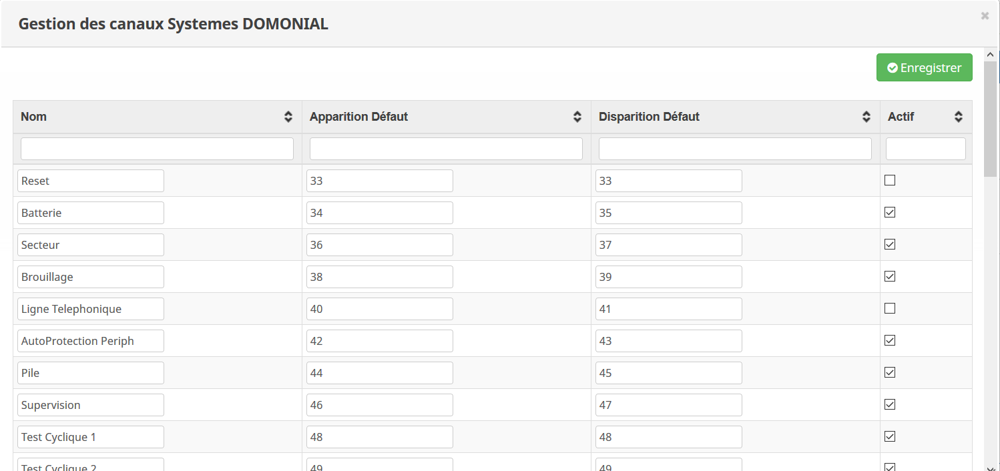

Description
===
Le plugin Domonial permet de recevoir les notifications que les centrales alarmes Domonial (PMI8FR-STD-7 ou PME8FR-STD7G)
envoient au travers d'une configuration de type "télésurveillance" en utilisant le GPRS de la carte SIM.
Une simple carte SIM suffit, pas d'abonnement data nécessaire.

> **Important** : 
> Si votre alarme est gérée par une entreprise de télésurveillance, vous ne pourrez pas utiliser ce plugin.

Configuration de la centrale
===
Tout d'abord, il faut configurer la centrale d'alarme grâce au logiciel DOMOPC, pour envoyer les notifications à Jeedom via GPRS

Nous allons commencer par configurer la carte GSM. Nous nous rendons dans le menu Transmetteur, onglet GSM/GPRS

Ici, nous configurons juste :
-    Le code pin de la carte SIM
-    L'APN correspondant à l'opérateur (dans l'exemple, il s'agit de l'APN de Free)

Puis, ensuite, nous configurerons comment la centrale doit transmettre les infos à Jeedom. Nous nous positionnons dans
le menu Transmetteur, onglet Standard.

> **Attention** :
>Cette partie doit déjà être configurée pour qu'en cas de déclenchement, la centrale d'alarme appelle sur un N° de téléphone au 
>travers de la ligne téléphonique ou au travers de la carte SIM. Ne modifiez donc pas les paramètres existants si vous ne savez 
>pas à quoi ils correspondent.

Ici, ce qui nous intéresse :

-    N° Téléphones/Destinataires. Ici on selectionne le réseau de type GPRS et configure l'adresse IP(public) et le port (AAA.BBB.CCC.DDD:55003) 
de notre Jeedom (utilisez le NAT de votre Firewall si nécessaire) dans un des emplacements libres de A, B, ou C (le GPRS n'est pas disponible pour
les autres emplacements). Ensuite on sélectionne le protocole (celui qui n'est pas utilisé par l'appel vocal de votre alarme) et c'est donc ce protocole qui sera utilisé
dans la configuration de vos canaux systèmes plus bas. Enfin, on selectionne l'APN configuré dans l'étape précédente (dans mon exemple 1).

-    Il est ensuite nécessaire de configurer le cycle d'appels. Ce paramètre sera à configurer dans les canaux systèmes plus loin.
Pour configurer le cycle d'appels, il suffit de renseigner trois fois la lettre du N° de Téléphones/destinataire que nous avons configuré 
(dans mon exemple j'ai configuré le destinataire B, mon cycle d'appel est donc le N°2: BBB). Cela permet à la centrale d'alarme de réemettre 3 fois 
la notification au cas où il y aurait un problème GSM/Internet.

-    Le dernier paramètre à configurer dans ce menu est le protocole. Comme vu plus haut, nous ne toucherons pas aux paramètres utilisés par la partie vocale.
Nous modifierons donc le second protocole utilisé ci-dessus. Il suffit de renseigner un code site (au choix, seule contrainte 8 digits),
puis choisir le protocole utilisé par la centrale=> SECOM3.

Enfin, nous allons configurer les alarmes qui seront remontées dans Jeedom. Ici, nous ne configurerons que les canaux systèmes.
Vous trouverez un exemple de configuration ci-dessous.

Les choses importantes à savoir :
-    Le champ Transmission permet de désactiver l'émission d'une notification pour cette alerte, 
FRONT permet de remonter simplement le passage d'un état OK vers NOK, mais pas le retour à la normale,
ETAT permet d'avoir le changement d'état OK vers NOK **et** le retour à la normale.

-    Ensuite, nous allons configurer les codes envoyés pour identifier l'alarme et son état. Dans le cas d'une 
transmission FRONT, un seul code suffit, pour une transmission ETAT, il sera nécessaire de configurer deux codes. 
Pour ma part, je fixe les mêmes codes pour le protocole 1 et 2, mais normalement, seuls les codes pour le procotole 
que nous avons configuré à l'étape précédente sont nécessaires. 

-    Enfin, nous selectionnons le cycle d'appels que nous avons précédement configuré.

Configuration du plugin dans Jeedom
===
Après l'avoir téléchargé sur le Market, il sera nécessaire de configurer le plugin. Ce qui nous intéresse se trouve 
dans l'encadré Configuration.

Dans la configuration du plugin, nous avons la possibilité de ne pas acquitter certains types d'alarme. Le plugin les recevra, 
mais ne les acquittera pas. Ce qui fait que l'alarme continuera son cycle d'appel. Cette configuration peut être utilisée si 
votre cycle d'appels est configuré pour le GPRS et ensuite pour l'appel vocal.

Ensuite, il faut configurer l'adresse ip (privée) de Jeedom et le port du plugin (par defaut : 55003)

Enfin, il faut configurer les codes d'alarme à l'identique de ceux que nous avons configuré sur la centrale d'alarme. Nous ne modifierons que 
les codes Systèmes, mais le plugin peut aussi recevoir les codes Péripheriques (il faudra dans ce cas les configurer sur 
l'alarme).

Je ne rentre pas dans les détails, car la configuration est exactement la même que celle sur la centrale d'alarme.

Ajout d'équipement dans le plugin
===
L'ajout d'un équipement dans Jeedom se passe comme pour tous les autres plugins. Il suffit de cliquer sur Ajouter. Une 
nouvelle fenêtre va s'ouvrir pour donner un nom à l'équipement (qui correspond à la centrale d'alarme).

Ensuite, la configuration est identique aux autres plugin, sauf pour le champ Site. Celui-ci correspond au code site que nous 
avons renseigné dans la centrale d'alarme dans le menu Transmetteur/Standard/Protocoles.

Nous passons dans l'onglet Commandes, il suffit de rajouter deux commandes décrites ci-dessous.

C'est finit, le plugin est prêt à fonctionner. 

Utilisation Avancée
===
Il est conseillé d'utiliser ce plugin avec la fonction scénario de jeedom. Un exemple ci-dessous permet de traiter la 
notification reçu par Jeedom lors de l'activation ou la désactivation de la centrale d'alarme et d'effectuer des actions (ici fermer les volets, envoyer une 
notification via slack). L'exemple ci-dessous montre aussi la réception d'une trame pour un problème de batterie sur la centrale
ou un problème de pile sur un capteur (respectivement code 73 ou 44). En dernier recours, le scénario envoi la trame brute receptionnée sur 
mon telephone via slack.

Depannage et diagnostic
===
Le deamon refuse de démarrer
-----------------------------
Essayez de le démarrer en mode debug pour voir l'erreur

Lors du démarrage en mode debug j'ai une erreur avec : /tmp/domonial.pid
-------------------------------------------------------------------------
Attendez une minute pour voir si le problème persiste, si c'est le cas en ssh faites : "sudo rm /tmp/domonial.pid"

Lors du démarrage en mode debug j'ai : can not start server socket, another instance alreay running
----------------------------------------------------------------------------------------------------
Cela veut dire que le deamon est démarré mais que Jeedom n'arrive pas à le stopper. Vous pouvez soit redémarrer tout le système, soit en ssh faire "killall -9 domonialcmd.py"
